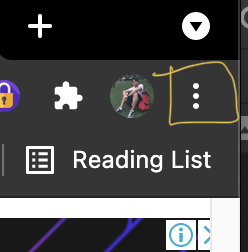
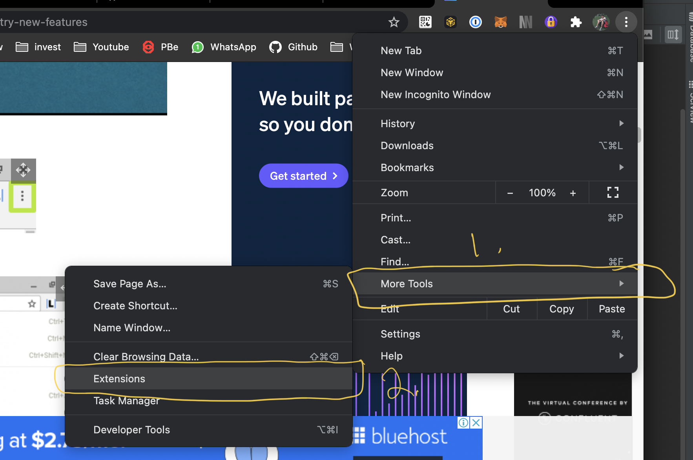
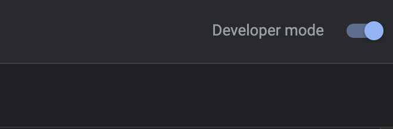
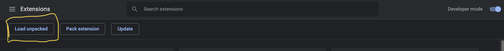
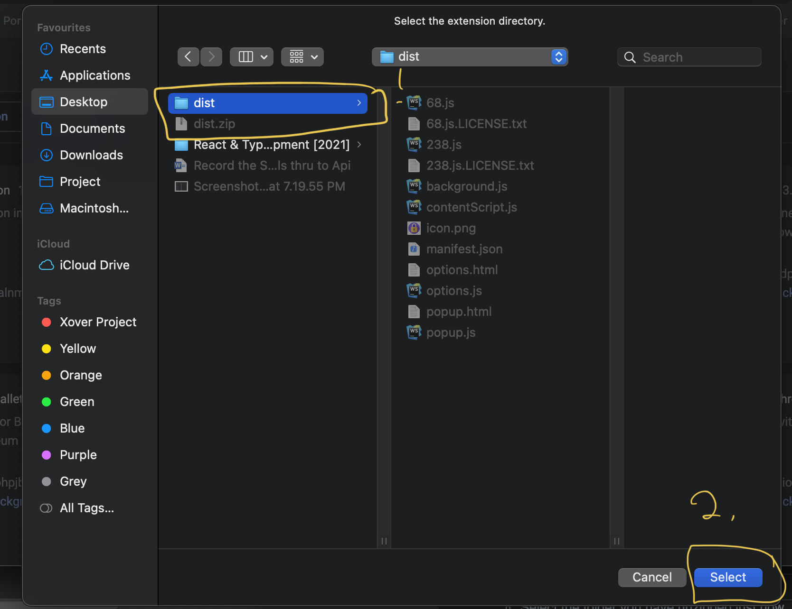
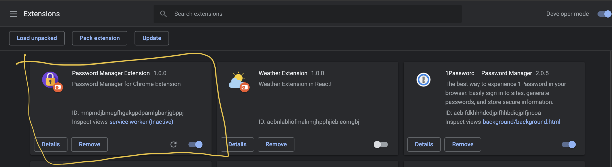
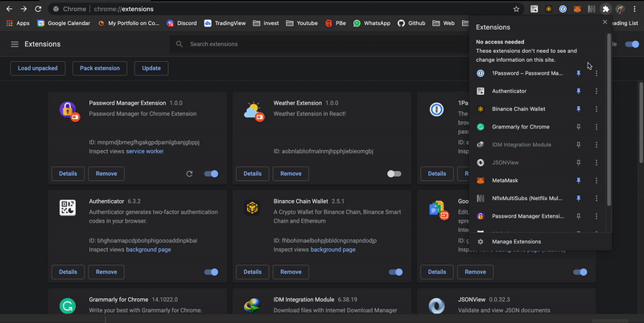

# PasswordManagerChromeExtension
This project is the Chrome extension version from  [PasswordManagerAngularWebVersion](https://github.com/zhentong98/PasswordManagerAngularFirebase) using React, firebase to build.

**Table of Contents**
- [Installation](#installation)

## Installation
1. Download the extension files. [Download](PasswordManager%201.0.1.zip)
2. Turned on the developer mode. <br>
    * Tips: you also can directly enter this on your Chrome should redirect to the extension page.
      ```
      chrome://extensions/
      ```
    * Click the Options button. <br>
      
      
    * Click on the `More tools` and `Extensions`. <br>
      
      
    * Make sure the `Developer Mode` is turned on. (On the right top side) <br>
      
      

      
3. Once the developer mode is turning on then we can install the extension now.
   * Unzip the zip file you download just now. if you haven't download please download now. [Download](dist.zip)
   * Click on the `Load unpacked` button on your extension page. <br>
      
     
   * Select the folder you have unzipped just now. <br>
      
     
   * Then you should see the extension have installed on your browser <br>
      
     
4. How to use ? <br>
   
